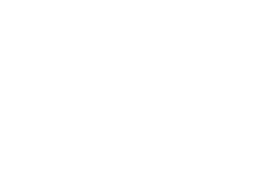

    

What if donations become transparent? Introducing a new and decentralised way to help!

<a href="https://fundingblocks.ml/">View Demo</a>

  
<b>Table of Contents</b>

  <ul>
    <li>
      <a href="#about-the-project">About The Project</a>
      <ul><li><a href="#built-with">Built with</li></ul>
    </li>
    <li><a href="#wheres-the-problem">Where's the Problem?</a></li>
    <li><a href="#presenting-funding-blocks">Presenting Funding Blocks</a></li>
    <li>
      <a href="#how-it-works">But, how does it work?</a>
      <ul><li><a href="#funds-transfer">Funds Transfer</a></li></ul>
    </li>
    <li><a href="#key-differentiators">Key Differentiators</a></li>
    <li><a href="#quick-start">Quick Start</a></li>
    <li><a href="#team">Team</a></li>
    <li><a href="#license">License</a></li>
  </ul>

# 🔎 About the Project

[Funding Blocks](https://fundingblocks.ml/) is the First of it's kind decentralised donation app. It eliminates majority of obstacles and risk factors that we face while Donating relief funds.
It ensures the transparency in a trustless environment, enabling rapid action to any disaster in the world.

### Built With

-   React
-   Bootstrap
-   Tezos
-   SmartPy

# ❓ Where's the Problem?

-   People donate less
    -   **No trust** on the organisations
    -   They don’t get anything in return
-   Sometimes It takes **weeks** to raise the minimum amount needed
    -   Average person gets aware in around 24 hours
    -   Spreading awareness consumes majority of time
    -   Some people are ready to contribute but don’t have funds on time
-   What if they raised 100k but only used 80k?
    -   No one knows
    -   But the donors have a **right to know**

# 🎁 Presenting Funding Blocks

-   Donors can raise fund before a calamity has occurred
    -   They get Certificate for donation as NFT
    -   Funds cannot be stolen
    -   They cannot be withdrawn without any need
-   Total amount collected is always transparent
    -   The total time can be just a couple of minutes
    -   Donors vote for the amount to be withdrawn
    -   Amount withdrawn is fully transparent

# 🤔 But, how does it work?

## Funds Transfer -

-   Donors vote for the withdraw amount
-   The voting process continues until
    -   25% of the total donors have voted or
    -   50% have downvoted it
-   If ≥ 50% have downvoted, the Funding Block is canceled
-   Else, the funds are transferred to the organisation.

# 🏁 Key Differentiators

✅ **Trustless**: Donors decide the amount

✅ **Speed**: Voting takes just a few hours

✅ **Transparent**: All numbers are public

✅ **Decentralised**: Power is distributed

✅ **Reward**: Donors get Certificate NFT

# ⚡️ Quick Start

##### `Install server dependencies`

-   npm install

##### `Install client dependencies`

-   cd client
-   npm install
-   npm start

##### `Build for production`

-   cd client
-   npm run build

Check in browser on http://localhost:3000/

# 🥂 Team

<table>
  <tbody><tr>
    <td align="center"><a href="https://github.com/OjusWiZard"> <b>Ojuswi Rastogi</b></a> <a href="https://github.com/Shruti3004/Funding-Blocks/commits?author=OjusWiZard" title="Contributions">💻 🖋</a></td> </a></td>
    <td align="center"><a href="https://github.com/Shruti3004"> <b>Shruti Agarwal</b></a> <a href="https://github.com/Shruti3004/Funding-Blocks/commits?author=Shruti3004" title="Contributions">💻 🖋</a></td> </a></td>
    <td align="center"><a href="https://github.com/shivamsingh-07"> <b>Shivam Singh</b></a> <a href="https://github.com/Shruti3004/Funding-Blocks/commits?author=shivamsingh-07" title="Contributions">💻 🖋</a></td> </a></td>
    <td align="center"><a href="https://github.com/SingingApple"> <b>Anurag Srivastava</b></a> <a href="https://github.com/Shruti3004/Funding-Blocks/commits?author=SingingApple" title="Contributions">💻 🖋</a></td> </a></td>
  </tbody></tr>
</table>

# 📝 License

This project follows the [MIT License](LICENSE).
